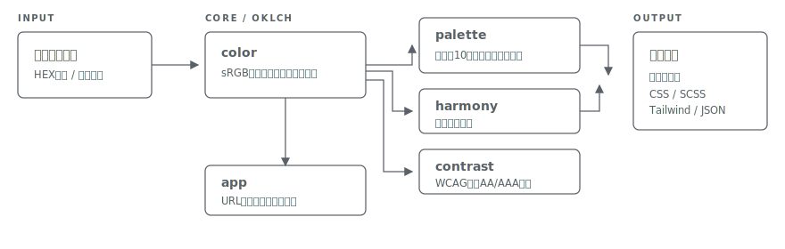

# shikisai

[](https://github.com/miruky/shikisai/actions/workflows/ci.yml)
[](https://www.typescriptlang.org/)
[](https://vitest.dev/)
[](https://opensource.org/licenses/MIT)

**ベースカラー1色から、WCAGコントラストを検証済みのトーンスケールとライト・ダーク両テーマを同時に設計するパレット生成器です。**

## 概要

色を1つ選ぶと、知覚均等なOKLCH色空間で明度を刻んだ10段のトーンスケールと、同じ色相から導いたライト・ダーク両テーマのデザイントークン(背景・サーフェス・ボーダー・本文・補足・プライマリ)を生成します。各トーンには白文字・黒文字を載せた場合のWCAG判定(AAA / AA / AA-large / fail)が付き、テーマプレビューでは本文とボタンの実測コントラスト比を表示します。あわせて補色・類似色・トライアドなど色相環上の配色も導き、気に入った色はワンクリックでベースに置き換えて掘り下げられます。トーンスケールが代表的な色覚特性(1型・2型・3型)でどう見えるかをシミュレートして見分けやすさも確認でき、結果はCSS変数・SCSS・Tailwind設定・JSONから選んでコピーできます。

動かす: https://miruky.github.io/shikisai/

### なぜ作ったのか

ライトテーマとダークテーマを別々に作ると、片方だけコントラスト不足になったり、色相がずれて別物の見た目になったりします。HSLの明度操作は知覚的に均等でないため、同じ操作でも色相によって結果の明るさがばらつくのも問題でした。shikisaiは生成をOKLCHで行うことで色相間の明度を揃え、本文AAA・ボタン文字AAを満たすようにトークンの明度を設計してあるため、どの色相を選んでも読めるテーマが出てきます。

## 使い方

1. ピッカーかHEX欄でベースカラーを決める。HEX欄は3桁・大文字・先頭の`#`なしも受け付ける。ランダムボタンで適度な彩度・明度の色を引くこともできる
2. トーンスケールのバッジで、各トーンに白字・黒字を載せられるか確認する。スケールの各色はクリックでHEXをコピーできる
3. 色覚シミュレーションで、トーンスケールが代表的な色覚特性(1型・2型・3型)でも見分けられるか確かめる
4. 配色のセクションで補色・類似色・トライアドなどを見比べ、良さそうな色をクリックして次のベースにする
5. テーマプレビューでライト・ダークの見え方と実測比を確認する
6. CSS変数(prefers-color-scheme対応)・SCSS・Tailwind設定・JSONから形式を選んでコピーする

選んだ色と書き出し形式はURLに保存されるため、リンクボタンでそのままの状態を共有できます。直前に見た色は「最近」として残り、クリックで戻せます。画面右上の切り替えで、地のテーマを自動(OSに追従)・ライト・ダークから選べます。キーボードからは `R` でランダム、`T` でテーマ切り替え、`C` で書き出しのコピーができます(入力欄にいるときを除く)。

### 出力されるCSS変数の例

```css
:root {
  --color-background: #fbfbfc;
  --color-text: #1f2935;
  --color-primary: #2f70c0;
  /* ... */
}

@media (prefers-color-scheme: dark) {
  :root {
    --color-background: #14181f;
    /* ... */
  }
}
```

## アーキテクチャ



sRGBとOKLCHの相互変換(`lib/color`)、WCAGコントラスト計算(`lib/contrast`)、スケールとテーマの導出(`lib/palette`)をDOM非依存の純粋なモジュールに分けています。sRGB色域に入らない高彩度の色は、色相と明度を保ったまま彩度だけを二分探索で切り詰めます。「本文はAAA、ボタン文字はAA以上」という保証は、複数の色相に対するプロパティテストとして検証しています。

## 技術スタック

| カテゴリ | 技術                            |
| :------- | :------------------------------ |
| 言語     | TypeScript 5(strict)            |
| 色空間   | OKLCH(自前実装、実行時依存なし) |
| ビルド   | Vite                            |
| テスト   | Vitest(50テスト)                |
| リンタ   | ESLint + Prettier               |
| CI / CD  | GitHub Actions                  |
| 配信     | GitHub Pages                    |

## プロジェクト構成

- `src/lib/color.ts` — sRGBとOKLCHの相互変換、色域判定と彩度の切り詰め、HEXの正規化
- `src/lib/contrast.ts` — WCAG相対輝度・コントラスト比・段階判定
- `src/lib/palette.ts` — トーンスケールとテーマトークンの導出、ランダム色、CSS / SCSS / Tailwind / JSON書き出し
- `src/lib/harmony.ts` — 色相環に基づく配色(補色・類似色・トライアドなど)の導出
- `src/lib/cvd.ts` — 二色覚(色覚特性)のシミュレーション
- `src/lib/share.ts` — ベースカラーと書き出し形式のURLクエリへの符号化・復号
- `src/lib/history.ts` — 最近使った色の履歴操作
- `src/theme.ts` — 自動・ライト・ダークのテーマ切り替え
- `src/app.ts` — 画面の構築とプレビュー、各操作の配線
- `docs` — アーキテクチャ図
- `.github/workflows` — CIとGitHub Pagesデプロイ

## はじめ方

### 前提条件

- Node.js 20以上

### セットアップ

```bash
git clone https://github.com/miruky/shikisai.git
cd shikisai
npm install
npm run dev
```

### テストの実行

```bash
npm test
```

### Lintの実行

```bash
npm run lint
```

### デプロイ

`main` ブランチへのプッシュでGitHub Actionsがビルドし、GitHub Pagesへ自動デプロイします。

## 設計方針

- **OKLCHで生成しsRGBで出力** — 明度の刻みが色相に依らず知覚的に揃う。HSL操作の明るさのばらつきを避ける
- **コントラストを後付けで検査せず設計に組み込む** — トークンの明度自体をAAA / AAを満たす位置に置き、テストで保証する
- **両テーマを同時に導出** — ライトとダークを同じ色相・同じ規則から作り、片方だけ破綻する事態をなくす
- **依存ゼロ** — 色変換もコントラスト計算も自前実装。計算はすべてブラウザ内で完結する

## ライセンス

[MIT](LICENSE)
